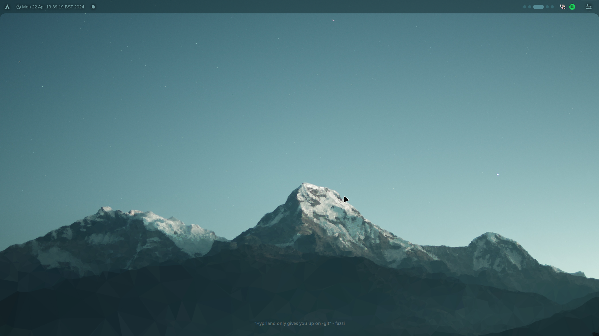
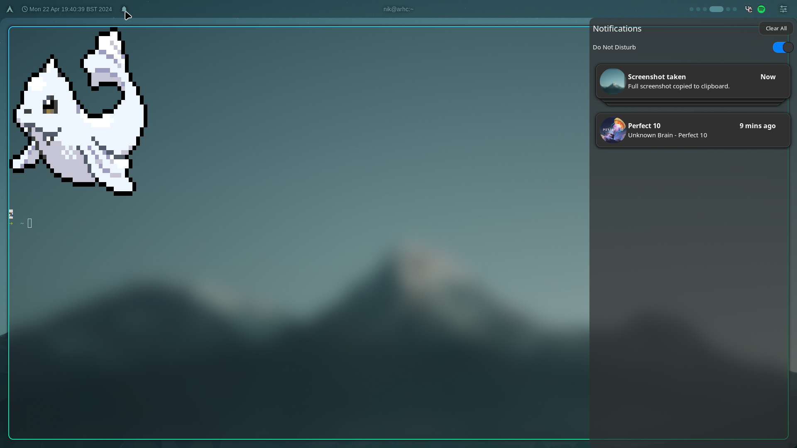
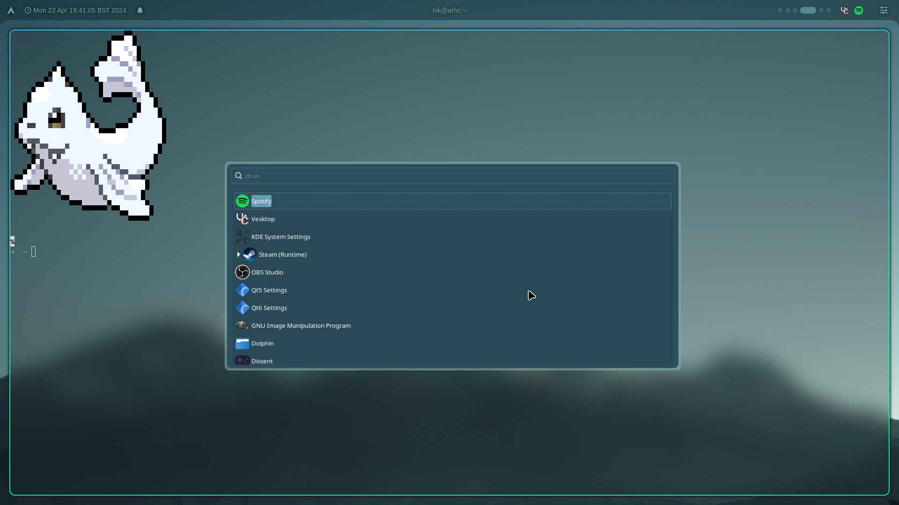
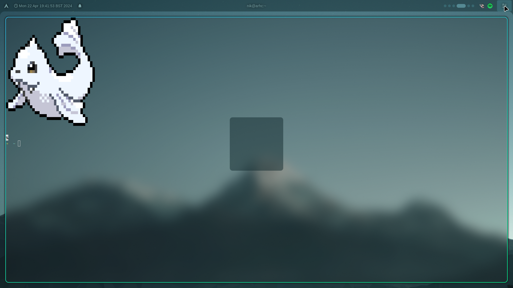
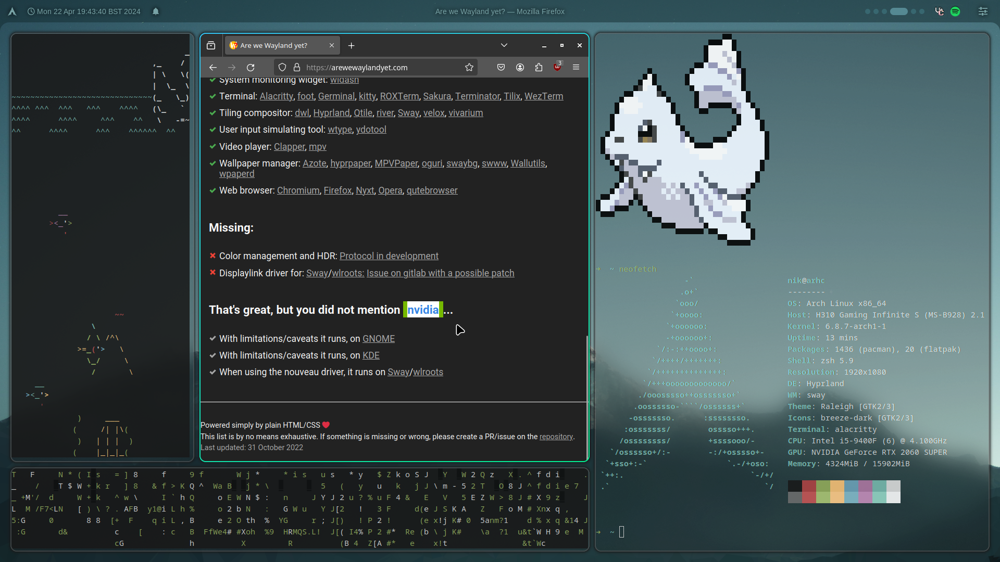

# DeadFry42 Linux Hyprland dotfiles

the .config files for my Hyprland rice.

my dotfiles for Hyprland, themed around the KDE Plasma "Mountain" background for KDE Plasma 5.27.

tested exclusively on nvidia. if not using nvidia, please remove the `~/.config/hypr/modules/nvidia.conf` file.

> [!NOTE]
> might become outdated fast (because im bad at being productive)  
> 
> these are my personal dotfiles. if you don't like something about it, you can fork it or something idk

> [!IMPORTANT]
> these are the experimental dotfiles.  
> things are expected to break / not work.  
> please wait until they are in the main branch until you use them.
>  
> many things are still destined to change, such as:
>   - notifications  
>   - application launcher
>   - control panel (it's still unfinished)
>   - config layout  

# required packages (arch)
-  hyprland
-  hyprlock
-  hypridle
-  aylurs-gtk-shellᴬᵁᴿ (top bar)
-  swaync (notification center)
-  hyprpaperᴬᵁᴿ (background)
-  wofi (app launcher, temp)
# optional packages
-  [fancygrim](https://github.com/memyboi/fancygrim) (my own creation) (screenshotting)
-  wlogoutᴬᵁᴿ (logout menu)
-  xdg-desktop-portal-hyprland (screensharing)
-  xdg-desktop-portal-gtk (filepicker)
-  polkit-kde-agent (giving root perms)
-  io.missioncenter.MissionCenter (flatpak) (task manager)

Install packages for this rice (arch only)  
`yay -S hyprland hyprlock hypridle aylurs-gtk-shell swaync hyprpaper wofi wlogout xdg-desktop-portal-hyprland xdg-desktop-portal-gtk polkit-kde-agent`  

Install io.missioncenter.MissionCenter
`flatpak install io.missioncenter.MissionCenter`

# features
-  a fully functioning bar made with ags
    - arch flex (i use arch btw)
    - clock (for telling time)
    - notifications (right now, just opens swaync)
    - titlebar
    - animated workspace switcher (inspired by gnome)
    - system tray
    - control panel (incomplete)
-  hyprland
    - hyprland
-  made for nvidia
    - still has a few quirks tho, due to the drivers
    - works *relatively* well on my 2060 Super w/ 555.58 drivers,
    - hyprland still doesn't support linux-drm-syncobj-v1
    - i'd recommend using integrated graphics instead for rendering hyprland if you can
-  cool lock screen
    - pc locks after 30 minutes of inactivity

# keybinds
| Keys | Action | Notes |
| :--- | :--- | :----|
| <kbd>Super</kbd> + <kbd>R</kbd> | Open Application launcher | Currently through wofi |
| <kbd>Super</kbd> + <kbd>H</kbd> | Alternate keyboard layouts | Config required |
| <kbd>Super</kbd> + <kbd>O</kbd> | Open Scratchpad | (it's just Hyprland's special workspaces |
| <kbd>Ctrl</kbd> + <kbd>Shift</kbd> + <kbd>Esc</kdb> | Task manager | io.missioncenter.MissionCenter flatpak required |
| <kbd>Super</kbd> + <kbd>0</kbd>-<kbd>9</kbd> | Move workspace | |
| <kbd>Super</kbd> + <kbd>Shift</kbd> + <kbd>0</kbd>-<kbd>9</kbd> | Move window to workspace | |
| <kbd>Super</kbd> + <kbd>L</kbd> | Lock | hyprlock required |
| <kbd>Super</kbd> + <kbd>Shift</kbd> + <kbd>S</kbd> | Full screenshot | fancygrim required, otherwise change in `modules/binds.conf` |
| <kbd>Super</kbd> + <kbd>Shift</kbd> + <kbd>X</kbd> | Area screenshot | fancygrim required, otherwise change in `modules/binds.conf` |
| <kbd>Super</kbd> + <kbd>Shift</kbd> + <kbd>Z</kbd> | Window screenshot | fancygrim required, otherwise change in `modules/binds.conf` |
| <kbd>Super</kbd> + <kbd>X</kbd> | Close applications | |
| <kbd>Super</kbd> + <kbd>M</kbd> | Power menu | |

Don't like the keybinds / need more keybinds?  
To go `~/.config/hypr/modules/binds.conf` and modify away! ([guide](https://wiki.hyprland.org/Configuring/Keywords/))

# preview

# installation
- make sure you use a display manager that supports the wayland session (eg sddm, gdm)
- install hyprland
- boot into hyprland with the `Hyprland` command in tty, or through your display manager of choice
- double check hyprland opens. [you may need to set kernel parameters](https://wiki.hyprland.org/Nvidia/) if you use nvidia and haven't already.
- install required packages (and optional packages if you'd like)
- import dotfiles from this repo
- configure ~/.config/hypr/modules/monitor.conf [using this guide](https://wiki.hyprland.org/Configuring/Monitors/)
- remove ~/.config/hypr/modules/nvidia.conf if not using a nvidia card 
- open hyprland
- done

# post-installation
- to configure things like keybinds, there is a folder called "modules" in `~/.config/hypr`. this is to organise your settings, and to make things more streamlined. follow the format that the file already has, and you'll be able to bind keybinds in the way you want.

# inspirations & thank yous
- aylur - making ags (aylur's gtk shell) and their amazing config (which i used as reference)  
- vaxry - hyprland
- various random ricers on the hyprland discord - inspiration  
