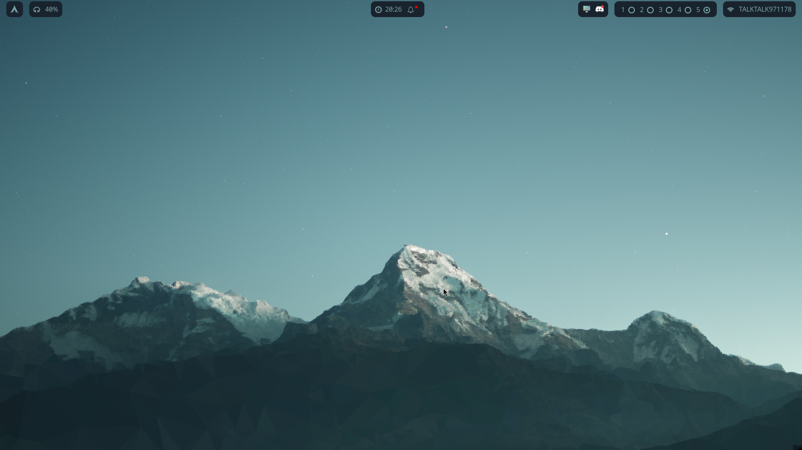
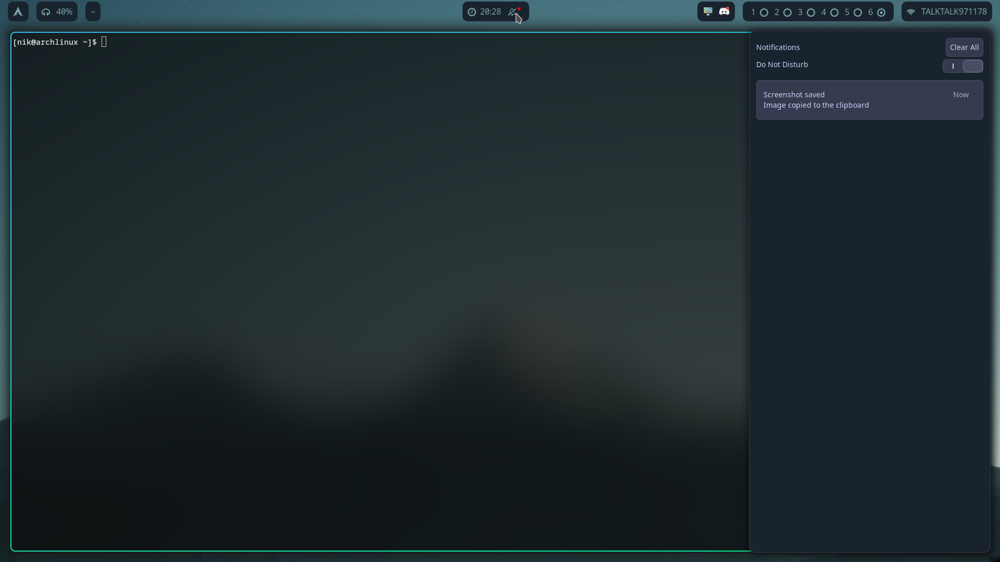
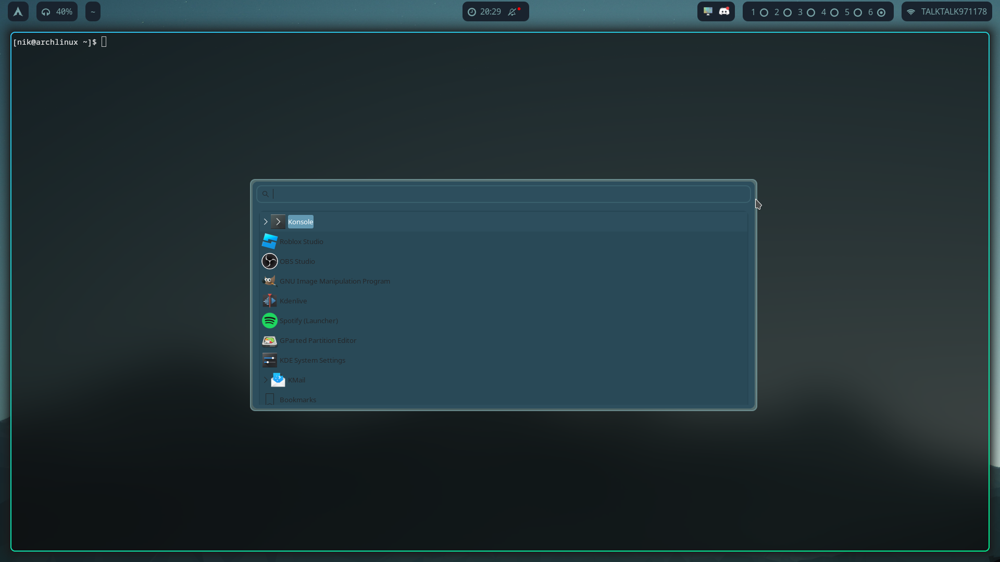
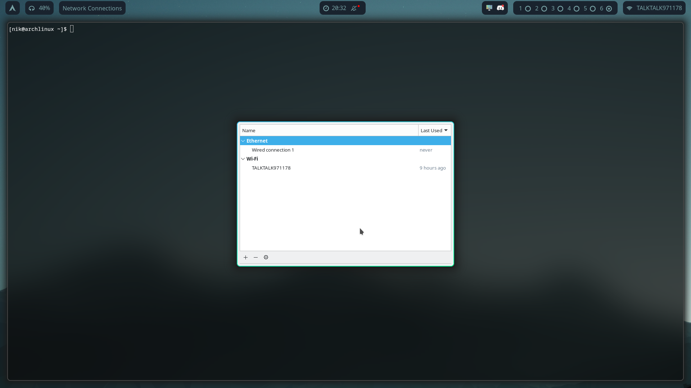
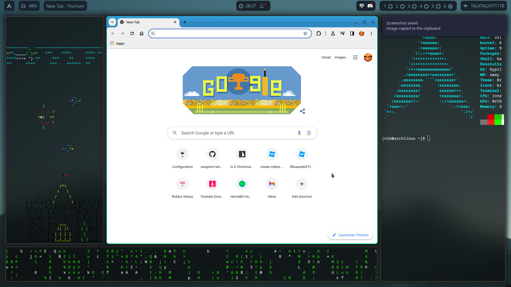

# dotfiles

the .config files for my Hyprland x KDE rice

dot files for Hyprland, themed around the KDE Plasma default background (as of plasma 5.27)

tested on a nvidia gpu, on arch and debian.
installed on arch w/ hyprland-nvidiaᴬᵁᴿ w/ yay
installed on debian w/ compiling from source

tested on RPI 4B (waybar & swaync not working)

note: might become outdated fast because of how indecisive i am sometimes (which is all the time btw) also adhd or something idfk im not diagnosed

# required packages
 -  hyprland / hyprland-gitᴬᵁᴿ (hyprland-nvidiaᴬᵁᴿ & its git variant has been discontinued)
 -  swaync (notification center)
 -  waybar (top bar)
 -  xwaylandvideobridgeᴬᵁᴿ (screensharing, primarily on discord)
 -  xdg-desktop-portal-hyprland (screensharing)
 -  xdg-desktop-portal-gtk (filepicker)
 -  hyprpaperᴬᵁᴿ (background)
 -  polkit-kde-agent (giving root perms)
 -  wofi (app launcher)
 -  ttf-nerd-fonts-symbols-mono (used by waybar)
 -  noto-fonts-emoji
 -  ttf-joypixels
 -  wlogoutᴬᵁᴿ
# optional packages
 -  yayᴬᵁᴿ (to help download aur packages)
 -  gnome-control-center (clicking on wifi & clock in waybar)
 -  grim (screenshotting)
 -  slurp (screenshotting)
 -  hyprshotᴬᵁᴿ (screenshotting)
 -  kitty (to use in hyprland, as it is the default in the auto generated config. I'd recommend using alacritty later)

# features
 - notifications, right click on bell to silence/unsilence
 - screensharing on outdated platforms (discord) via xwaylandvideobridge
 - polkit authentication via kde's agent
 - gtk filepicker
 - applicaton launcher with wofi
 - clicking on wifi in top right to configure wifi
 - changing volume by scrolling on the volume widget in the top left
 - opening wofi from clicking on the arch icon
 - clicking on workspace brings you to that workspace
 - system tray
 - wlogout
 - hyprland (obviously)

# keybinds
 - full screenshot with Super+Shift+S
 - region screenshot with Super+Shift+X
 - open wofi with Super+R
 - see logout screen with Super+L
 - move workspaces 1-10 with Super+(1-9 & 0)
 - kill apps with Super+X
 - toggle floating on programs with Super+V
 - close hyprland with Super+M
 - do some funky resizing stuff with Super+P
 - add ur own keybinds in ~/.config/hypr/settings/binds.conf ([guide](https://wiki.hyprland.org/Configuring/Keywords/))

# screenshots

# installation
- make sure you use a display manager that supports the wayland session (eg sddm, gdm, or just tty cuz y not)
- install hyprland or hyprland-gitᴬᵁᴿ
- boot into hyprland with the `Hyprland` command in tty, or through ur display manager
- double check hyprland opens. [you may need to set kernel parameters](https://wiki.hyprland.org/Nvidia/) if you use nvidia.
- install required packages (and optional packages if you'd like)
- import dotfiles from this repo
- configure ~/.config/hypr/settings/monitor.conf [using this guide](https://wiki.hyprland.org/Configuring/Monitors/)
- boot hyprland
- done

# post-installation
- to configure things like keybinds, there is a folder called settings in ~/.config/hypr. this is to organise your settings, and to make things more streamlined. follow the format that the file already has, and you'll be able to bind keybinds in the way you want.
